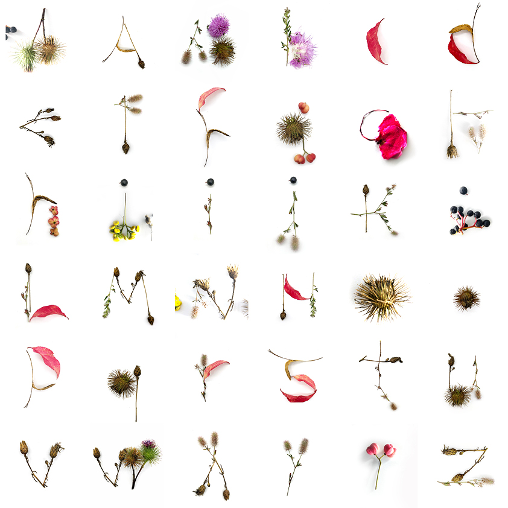

# abc-natur-1
This font was inspired by the spring season of 2023.

Type system intended for optimizing the available space in press media and other publications. It has a compact appearance which allows for small font sizes and tight leading while achieving solid lines and robust paragraphs.

Es könnte ein text sein werden 

Tipografía es sistema, ¿qué es sistema? 

Schriften sind ein System. Was ist ein System?

Neue Werkzeuge und Schreibträger eröffnen uns neue Möglichkeiten des Duktus und der Proportionen, um einen Libre-Font zu entwickeln. Die Sprachenvielfalt ist überall.

![PDF Specimen] (specimen/abc1natur.pdf)

///

It could be a text.

Typography is a system, what is a system?
Fonts are a system. What is a system?

New tools and writing surfaces open up new possibilities for ductus and proportions to develop a Libre Font. Diversity is everywhere.

Minimal nature. 2023.

![https://github.com/CaroGiovagnoli/abc-natur-1/blob/main/specimen/naturaleza%20minima2.jpg]

![PDF Specimen https://github.com/CaroGiovagnoli/abc-natur-1/blob/main/specimen/abc1natur.pdf]
